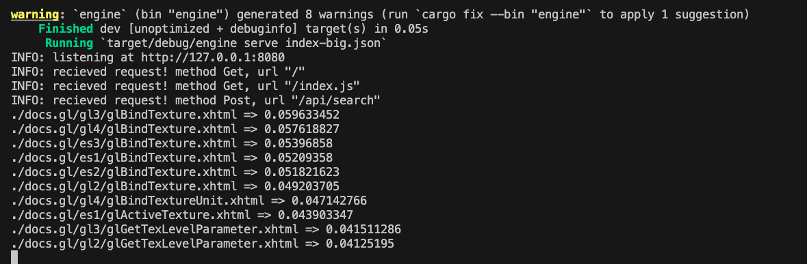

# FastSearch

> A high-performance, Rust-based search engine for indexing and searching document collections locally.

## Overview

FastSearch is a lightweight, fast search engine implementation whose core is written in Rust. It provides a web interface for easy searching and is designed to index documents from local directories, making it ideal for organizations or individuals who want to search through their own document collections efficiently.

The engine now uses SQLite as its default storage backend, which provides better performance and scalability compared to the previous JSON-based storage.



## Features

- **High Performance**: Core search functionality implemented in Rust
- **SQLite Backend**: Fast, reliable storage for search indices
- **Full-Text Search**: TF-IDF based ranking algorithm
- **Web Interface**: Easy-to-use browser interface for searching
- **Command-line Tools**: Simple CLI for indexing and searching
- **Cross-platform**: Works on Windows, macOS, and Linux

## Installation

### Prerequisites

- [Rust](https://www.rust-lang.org/tools/install) (1.56 or later)
- [Cargo](https://doc.rust-lang.org/cargo/getting-started/installation.html) (included with Rust)

### Install from Source

1. Clone the repository:
   ```bash
   git clone https://github.com/Himasnhu-AT/FastSearch.git
   cd FastSearch
   ```

2. Make the script executable (Unix/macOS):
   ```bash
   chmod +x fast_search.sh
   ```

## Quick Start

### Indexing Documents

To index a directory of documents:

```bash
# On Unix/macOS
./fast_search.sh index /path/to/documents

# On Windows
fast_search.bat index C:\path\to\documents
```

This will create an `index.db` file in the `packages/engine` directory.

### Running Search Queries

To search for terms in the indexed documents:

```bash
# On Unix/macOS
./fast_search.sh search index.db "your search query"

# On Windows
fast_search.bat search index.db "your search query"
```

### Starting the Web Interface

To start the web server with a search interface:

```bash
# On Unix/macOS
./fast_search.sh serve index.db

# On Windows
fast_search.bat serve index.db
```

Then open your browser and go to http://127.0.0.1:6969/

### Cleaning Up

To remove index files and clean the build:

```bash
# On Unix/macOS
./fast_search.sh clean

# On Windows
fast_search.bat clean
```

## Advanced Usage

### JSON Storage (Legacy)

If you prefer to use the legacy JSON storage instead of SQLite:

```bash
# On Unix/macOS
cd packages/engine
cargo run --json index /path/to/documents

# On Windows
cd packages\engine
cargo run --json index C:\path\to\documents
```

### Custom Server Address

To run the server on a different address:

```bash
# On Unix/macOS
./fast_search.sh serve index.db 192.168.1.100:8080

# On Windows
fast_search.bat serve index.db 192.168.1.100:8080
```

## Technical Details

FastSearch uses a Term Frequency-Inverse Document Frequency (TF-IDF) algorithm to rank search results. The search index is stored in a SQLite database, providing fast access and reduced memory usage compared to in-memory or JSON file storage.

For more technical details, see the [technical documentation](dev-docs/tf_idf.md).

## Contributing

Contributions are welcome! Please feel free to submit a Pull Request. To contribute to this repo, follow our [contribution guidelines](dev-docs/contributing.md).

## License

This project is licensed under the [MIT License](LICENSE).

## Changelog

See [Changelog](dev-docs/changelog.md) for details on recent changes.
